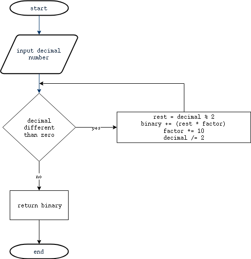
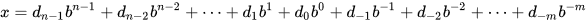
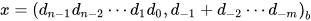
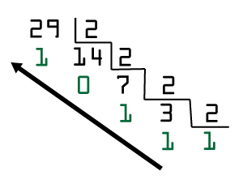

# Decimal-Binary-Converter
Just a simple C program that receives a decimal number and convert to binary.


O sistema binário é um sistema de numeração posicional [1] em que todas as quantidades se representam com base em dois números, zero e um.

O sistema binário é base para a Álgebra booleana, que permite fazer operações lógicas e aritméticas usando-se apenas dois dígitos. Toda a eletrônica digital e computação estão baseadas nesse sistema, que permite representar circuitos eletrônicos digitais, os números e caracteres. Os programas de computadores são codificados sob a forma binária.

O BCD (binary coded decimal) é o código que converte decimal para binário. Ao pegarmos no valor em decimal podemos facilmente convertê-lo para binário, mas a numeração binária é extensa na medida que se obtém muitos dígitos na finalização da conversão. Temos a seguinte ordem de ações para obter um valor em notação científica binária:




```C
    if( decimal >= 0) {
         sN = log10( decimal ) / log10( 2.0 );
         sN1 = quo( sN );
         sN2 = pot( 2.0, multi( sN ), 1 );
    } else {
         if( decimal < 0 ){
             decimal = decimal * -1;
             sN = log10( decimal ) / log10( 2.0 );
             sN1 = quo( sN );
             sN2 = pot( 2.0, multi( sN ), 1 ) * -1;
             decimal = decimal * -1;
         }
    }

```


[1] Notação posicional é um modo de representação numérica na qual o valor de cada algarismo depende da sua posição relativa na composição do número. O valor do número é a soma de cada algarismo que o compõe, considerando a posição em que o mesmo se encontra. Um número *x* pode ser representado num sistema de base *b* conforme o polinômio:



Onde *n* é a quantidade de dígitos inteiros e *m* a quantidade de dígitos fracionados, sendo *n-1* o dígito mais significativo e *-m* o menos significativo e *d¬j* são os dígitos que compõem a representação do número *x*.



Para converter de decimal para binário utiliza-se o método das divisões sucessivas pela base dois e o resultado é dado pelos restos das divisões no sentido da última divisão para a primeira.


